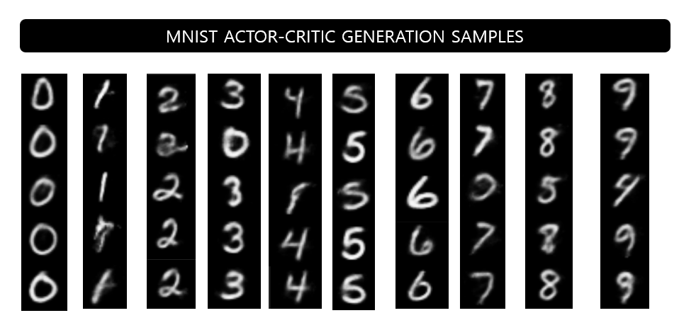
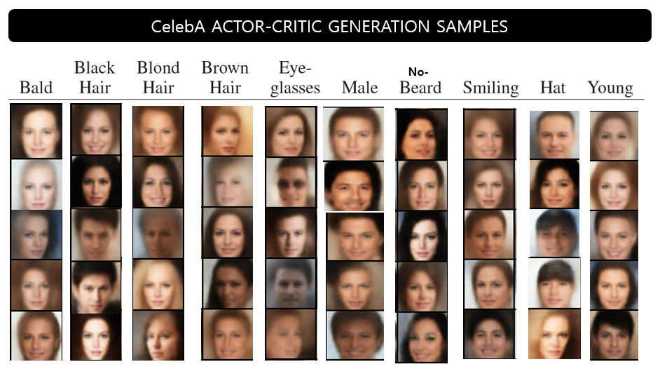

# Pytorch-Latent-Constraints-Learning-to-Generate-Conditionally-from-Unconditional-Generative-Models
**[Jesse Engel, Matthew Hoffman, Adam Roberts, "Learning to Generate Conditionally from Unconditional Generative Models" arXiv preprint arXiv:1711.05772 (2018)](https://arxiv.org/abs/1711.05772).**
## Meta overview
This repository provides a PyTorch implementation of Learning to Generate Conditionally from Unconditional Generative Models implemented .


## Current update status
* [ ] Reproduce result as the paper 
* [ ] Atrribute Classifier 
* [ ] Gradinet Penalty
* [x] Tensorboad loggings
* [x] Trainer  
* [x] Implemented a actor-crtic pairs , Distance Penalty 
* [x] Implemented VAE


## Results


###  MNIST Results
<p align="center"></p>

### CelebA Results 
<p align="center"></p>


## Usage

#### 1.Clone the repository 
```bash
$ git clone https://github.com/cheonbok94/Pytorch-Latent-Constraints-Learning-to-Generate-Conditionally-from-Unconditional-Generative-Models.git
$ cd Pytorch-Latent-Constraints-Learning-to-Generate-Conditionally-from-Unconditional-Generative-Models
```

#### 2.Download datasets (Celeba) & install requirement packages
```bash
$ bash download.sh 
```

#### 3. Train

##### (1) Training VAE

##### (2) Training a Actor-Critic Pairs

 

